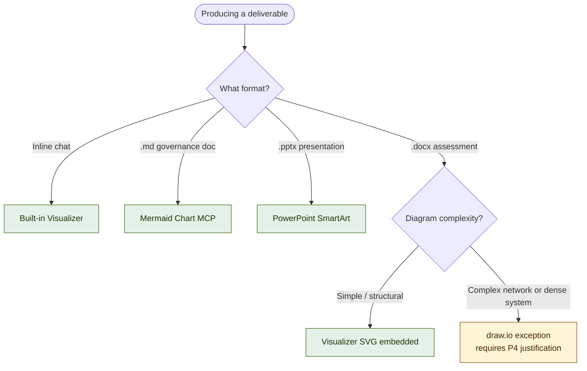
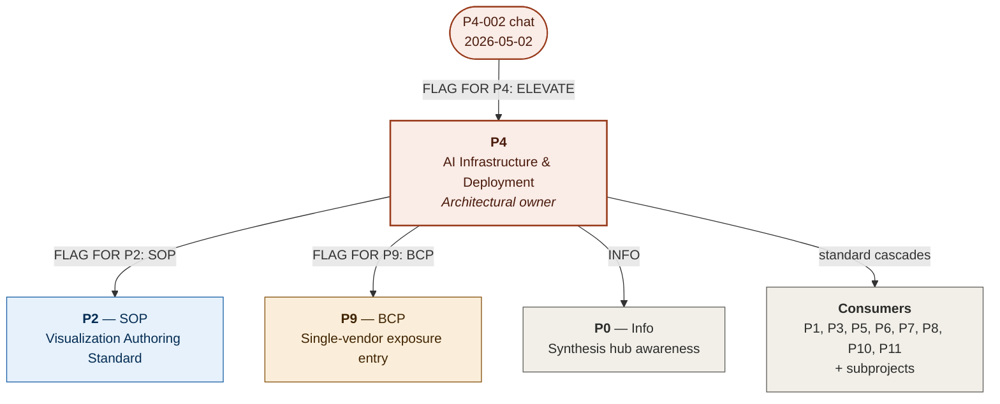

# ADR-001: Visualization Tooling Architecture

| Field | Value |
|---|---|
| **Status** | **APPROVED** |
| **Decision date** | 2026-05-02 |
| **Approved by** | Gregory Bernardo (President, BCG Corp) |
| **Originating session** | P4-002 chat 2026-05-02 |
| **Architectural owner** | P4 — AI Infrastructure and Deployment |
| **Originating subproject** | P4-002 — Revit and BIM Automation |
| **ADR number** | ADR-001 (first artifact in BCG ADR sequence) |
| **Supersedes** | None |
| **Related** | GOV-013 (Tools Inventory), GOV-017 (P4-002 Technical Architecture), pending Visualization Authoring Standard SOP (P2 queue) |
| **Review cadence** | Annual full review (next: 2027-05-02) co-owned by P4 and P9; quarterly health check by P4 |
| **Reversibility** | Fully reversible — disable any one tool with one decision; no licensing lock-in beyond what BCG already pays for (M365) |

---

## 1. Context

BCG's ecosystem produces deliverables in five distinct formats: inline chat outputs (working sessions, brainstorms), `.docx` documents (assessments, memos, ADRs), `.pptx` presentations (client-facing slide decks), Markdown governance documents (committed to `bcg-ops-governance` GitHub repo), and Claude project memory (persistent derived facts). Without an architectural standard, each project independently selects visualization tools, creating tool sprawl, inconsistent output quality, licensing duplication, and undocumented vendor dependencies that complicate business continuity planning.

Eleven candidate tools were evaluated in the originating session. Evaluation criteria: integration depth with BCG's current stack (Claude.ai, M365, GitHub), per-seat licensing cost, format portability, version-control compatibility, multi-user collaboration capability, and BCG-specific deliverable fit. Only Mermaid Chart currently has true MCP integration in BCG's authorized connector set; everything else is either built into Claude.ai natively, built into BCG's existing M365 license, or external requiring manual round-trips.

This ADR formalizes the selection so that all ecosystem projects (P0 through P11 and active subprojects P4-001 through P8-001) operate against a common standard rather than each project re-litigating the question.

---

## 2. Decision — The Adopted Stack

Four tools are adopted. Each is mapped to a specific deliverable format and use case. No other visualization tools are authorized for production deliverables without an exception approved through P4.

| Tool | Primary use | Format produced | Why this tool |
|---|---|---|---|
| **Built-in Visualizer** (Anthropic Claude) | Inline chat brainstorming; structural and flow diagrams during planning sessions | Inline SVG / HTML widgets in Claude.ai chat | Native to Claude.ai — zero auth, zero licensing, instant render. Persists via chat URL within the Claude project. Renders during the working session, when visual thinking aids are most valuable. |
| **Mermaid Chart MCP** | Diagrams in governance documents — flowcharts, sequence diagrams, ER diagrams, Gantt charts | Mermaid code blocks in Markdown files (`.md`) | Diagrams-as-code: source lives in the same `.md` file as the rule it illustrates, version-controlled with the governance doc. GitHub renders Mermaid natively without plugins. If the MCP is unavailable, diagrams still render in GitHub — the syntax is open. |
| **PowerPoint SmartArt** | Client-facing presentations: hierarchies, processes, lists, simple org charts | Native PowerPoint shapes embedded in `.pptx` | Already in every BCG production user's hands via M365. Zero new tooling. Adequate for ~60% of presentation visual needs without leaving PowerPoint. |
| **draw.io / diagrams.net** | Backup for diagrams that exceed Mermaid's auto-layout capability — typically complex network topologies, dense system diagrams | Open `.xml` format committed to GitHub; SVG/PNG export for embedding | Free, open-source, no licensing pain. `.xml` format is text-based and version-controllable. Use only when Mermaid is genuinely insufficient — must be justified per-instance and approved by P4. |

### Tool selection decision

---

## 3. Alternatives Rejected

The following tools were explicitly considered and rejected. Re-opening any of them requires a new ADR with explicit justification.

| Tool | Rejection rationale |
|---|---|
| **Microsoft Visio** | Per Gregory direction in originating session: skip without verifying M365 license tier. Even if licensed, the manual export workflow and proprietary `.vsdx` format provide insufficient marginal value over the adopted stack. |
| **Lucidchart** | Per-seat licensing not justified at BCG's nine-person size. No MCP integration. Manual export to SVG/PNG required for any committed artifact. Diagrams do not version-control with governance docs. |
| **Miro / Mural** | Whiteboard aesthetic mismatched with BCG's technical and governance deliverable formats. Per-seat licensing. Best use case (multi-user workshops) is decoupled from the deliverable production question this ADR addresses. |
| **Figma / FigJam** | Designer-tool DNA inappropriate for BCG's technical and governance use cases. BCG does not produce UI design work at meaningful scale. |
| **Excalidraw** | Hand-drawn aesthetic inappropriate for governance and client-facing deliverables. Useful only for ideation sketches, which the Visualizer covers natively. |
| **Whimsical** | Closed proprietary format. Subscription required. Duplicates Lucidchart capability without sufficient differentiation. |
| **Canva** | Marketing-aesthetic output mismatched with engineering and governance deliverables. Possible RFP-cover-material use case (P8) is out of scope for this ADR. |
| **Google Drawings / Slides** | BCG operates on M365, not Google Workspace. Adopting Google tooling would create cross-platform friction without offsetting benefit. |

---

## 4. Cross-Project Impact and Consequences

This ADR applies to every ecosystem project. Specific impacts and required actions per project:

| Project | Impact | Action / consequence |
|---|---|---|
| **P0** | Synthesis hub awareness only | No direct action. Future strategic synthesis outputs reference this standard rather than re-deriving visualization choices. |
| **P1** | Financial models, pricing analyses | Charts and matrices in pricing decks use SmartArt or Visualizer SVG. Spreadsheet outputs unchanged. |
| **P2** | SOP authoring (DIRECT FLAG) | `[FLAG FOR P2 — SOP CANDIDATE]` Author Visualization Authoring Standard SOP (W-XX) as operational companion. |
| **P3** | Competitive intel, BD documents | Competitor matrices and teaming evaluations use SmartArt or Visualizer. |
| **P4** | Architectural owner (DIRECT FLAG) | `[FLAG FOR P4 — ELEVATE]` P4 owns this ADR going forward. Maintains the stack, approves exceptions, coordinates registry assignment. |
| **P5** | IT security architecture diagrams | Network topology diagrams use Mermaid where adequate; draw.io as the sanctioned exception (network diagrams are draw.io's strongest case). |
| **P6** | Org charts, headcount diagrams | SmartArt for client-presented org charts; Mermaid for governance-doc-embedded reporting structures. |
| **P7** | Odoo module specifications | ER diagrams use Mermaid (`erDiagram` syntax). Module dependency diagrams use Mermaid flowchart syntax. |
| **P8** | RFP responses, proposal docs | Visualizer SVG embedded in `.docx` for technical sections. SmartArt for client-facing slide content. RFP cover/marketing material remains an open question. |
| **P9** | BCP (DIRECT FLAG) | `[FLAG FOR P9 — BCP RISK ENTRY]` Add visualization-tool dependency to dependency risk register. See Section 5. |
| **P10** | Legal and compliance | No direct impact. Use case too narrow. |
| **P11** | Candidate OSINT | No direct impact. |
| **Subprojects** | P4-001, P4-002, P4-003, P5-001, P5-002, P8-001 | Inherit the standard from parent satellites. P4-002 updates GOV-017 to reference this ADR. |

### Routing topology

---

## 5. Business Continuity Assessment (P9 Routing)

This section is the substance of `[FLAG FOR P9 — BCP RISK ENTRY]`. P9 should integrate the contents below into the BCG Enterprise BCP dependency risk register on adoption.

### 5.1 Risks identified

| Risk | Failure mode | Blast radius |
|---|---|---|
| Anthropic Claude.ai outage or pricing change | Built-in Visualizer becomes unavailable mid-session; chat-inline diagrams cannot render | Working sessions degrade. No deliverable is blocked because the Visualizer produces ephemeral chat content, not committed artifacts. Mitigated by Mermaid as the committed-artifact path. |
| Mermaid Chart MCP outage or deauthorization | MCP authoring assistance unavailable during sessions | **LOW.** Mermaid syntax is open. Existing `.md` files in `bcg-ops-governance` render in GitHub natively without the MCP. The MCP is an authoring accelerant, not a runtime dependency. |
| Mermaid project abandonment | Mermaid syntax stops being maintained or rendered | **LOW–MEDIUM.** Mermaid is widely-adopted and multi-vendor-rendered (GitHub, GitLab, Notion, Obsidian, VS Code). On project abandonment, existing `.md` files continue to render across all those platforms for years. |
| M365 outage or licensing change | PowerPoint SmartArt unavailable; `.pptx` authoring blocked | **MEDIUM.** Affects all client presentations, not just visualizations. Already in P9's register; this ADR adds no new exposure. |
| draw.io project abandonment | Backup tool stops being maintained | **LOW.** `.xml` format is open and human-readable. Multiple forks and successors exist. Used only for exceptions. |
| Combined vendor outage (Anthropic + Mermaid + M365 simultaneously) | All visualization paths fail at once | **Acceptable.** No single client deliverable would be blocked because text-only delivery is always a fallback. Mermaid syntax can be authored manually as text and committed even with all rendering tools down — the syntax remains the source of truth. |

### 5.2 Single points of failure

Two single-vendor dependencies exist in the adopted stack:

- **The built-in Visualizer is Anthropic-only.** No alternate provider. **Acceptable** because the Visualizer produces ephemeral working-session content, not committed BCG artifacts. If Anthropic disappears overnight, nothing in BCG's deliverable pipeline is destroyed.
- **PowerPoint SmartArt is Microsoft-only.** No alternate provider with format-compatible output. Already covered by the existing M365 entry in the dependency risk register.

**Mermaid is *not* a single point of failure** despite being a single product, because the Mermaid syntax is implemented by multiple independent renderers (GitHub, GitLab, Notion, Obsidian, VS Code, mermaid-cli). The artifact (the `.md` file) outlives the original tool.

### 5.3 Mitigations

- **PRIMARY:** Governance docs use Mermaid syntax committed in `.md` files. Diagram source is text in GitHub. Rendering depends on consumers (GitHub, VS Code, etc.), not on a single vendor.
- **SECONDARY:** draw.io as sanctioned backup. Open `.xml` format. Fully offline-capable. Multiple maintainers and successor projects.
- **TERTIARY:** Text-only delivery is always available. Any diagram in BCG's deliverable set can be replaced with a labeled list in worst case. No client work is blocked by visualization-tool failure.
- **OPERATIONAL:** BCG does not embed visualization tooling into critical-path workflows. No automated build process or deployment pipeline depends on visualization tool availability.

### 5.4 Acceptable failure modes

All identified failure modes are acceptable. No combination of visualization-tool failures blocks a client deliverable, halts a billable hour, or compromises a regulatory commitment. The worst realistic case is a working-session degradation (no inline diagrams during a planning chat), recoverable by reverting to text-based collaboration.

### 5.5 Review cadence

- **Annual full review** of this ADR (next: 2027-05-02) co-owned by P4 and P9.
- **Quarterly health check** by P4: confirm each tool in the stack remains available, licensed, and supported. Tool changes documented as ADR amendments or new ADRs.
- **Trigger review on:** any tool announcing deprecation; any net-new use case the current stack cannot serve; any pricing change affecting BCG's licensing position.

---

## 6. Implementation Actions

| # | Action | Owner | Status |
|---|---|---|---|
| 1 | Approve this ADR | Gregory | ✅ **COMPLETE** (2026-05-02) |
| 2 | Assign canonical number from BCG Governance Doc Registry | Gregory + P4 | ✅ **COMPLETE** — assigned **ADR-001**; new ADR sequence established |
| 3 | Commit ADR to `bcg-ops-governance/standards/` as canonical reference (this Markdown file) | P4 | ✅ **COMPLETE** (2026-05-03) |
| 4 | Update `BCG_Governance_Doc_Registry.md` with ADR-001 entry (and new ADR section if first ADR) | P4 | ✅ **COMPLETE** (2026-05-03, commit 5b9a1f2) |
| 5 | Author Visualization Authoring Standard SOP (W-XX) | P2 / Jennifer queue | ⬜ Open |
| 6 | Add visualization-tool dependency to BCG Enterprise BCP dependency risk register (use §5 as source) | P9 / Bob | ⬜ Open |
| 7 | Update GOV-017 (P4-002 Technical Architecture) to reference ADR-001 for visualization tooling | P4-002 / Cory | ⬜ Open |
| 8 | Notify ecosystem project owners — one-line Slack post per project channel referencing the GitHub-committed ADR | Gregory | ⬜ Open |

---

## 7. Routing and Handoffs

Per BCG Project Ecosystem and Handoffs (EAB v1.7), this document routes through the following channels.

`[FROM: P4-002 — Revit and BIM Automation] [DATE: 2026-05-02] [TOPIC: ADR-001 Visualization Tooling Architecture — APPROVED, Promoted to P4]`

**`[FLAG FOR P4 — ELEVATE]`** P4 owns ADR-001 going forward. Maintains the stack, approves exceptions, coordinates GOV registry health, schedules annual review with P9.

**`[FLAG FOR P2 — SOP CANDIDATE]`** Author Visualization Authoring Standard SOP (W-XX) as operational companion. Should cover: tool selection rules, Mermaid embedding patterns in governance docs, draw.io exception justification process, SmartArt conventions for client decks, exception escalation path through P4.

**`[FLAG FOR P9 — BCP RISK ENTRY]`** Add visualization-tool dependency to BCG Enterprise BCP dependency risk register using §5 as source content. Schedule annual review co-owned with P4 and quarterly health check by P4.

**`[INFO TO P0 — SYNTHESIS HUB]`** Awareness only. P0 references ADR-001 in future strategic synthesis outputs touching deliverable production or visualization choices.

---

## 8. Approval Record

| Date | Event | Recorded by |
|---|---|---|
| 2026-05-02 | Originating session: P4-002 chat — visualization toolkit assessment, skip-list confirmation, BCP framing | P4-002 chat history |
| 2026-05-02 | Status PROPOSED → APPROVED. Number assigned: ADR-001. New ADR sequence established for BCG. | Gregory Bernardo, P4-002 chat |
| 2026-05-02 | Memory edit #8 added to Claude project P4-002 memory: proactive visualization offers during planning sessions | Claude project memory |
| 2026-05-03 | Action 3 + Action 4 complete: this canonical Markdown committed to `standards/`; Registry v1.3 → v1.4 with new Section 6 (ADRs). Companion .docx archive committed 2026-05-03. | P4 / Greg via direct GitHub API commit |

---

## 9. ADR Sequence Convention

ADR-001 establishes the **ADR-NNN** sequence as a new BCG artifact class, distinct from the existing **GOV-NNN** sequence.

**Distinction:**
- **ADR-NNN** documents *the decision and its rationale* — what was chosen, what was rejected, and why. Architectural decisions only.
- **GOV-NNN** documents *the resulting rules* — standards, inventories, registries, and operational doctrine.

A given subject may have both: ADR-001 (this document, the decision) is operationally companioned by the pending Visualization Authoring Standard SOP (the rules), which receives a W-NN number from the SOP library, not an ADR or GOV number.

**Future ADR candidates** (not assigned, illustrative only):
- ADR-002: AI engine selection (CPython 3.12 vs IronPython 2.7.12 default — pending GOV-017 review)
- ADR-003: MCP server adoption posture (re-scoping I-71 around `mcp-server-for-revit-python`)
- ADR-004: Diagrams-as-code defaulting in governance repo

These are illustrative only — none are queued. The point is that BCG now has a documented place to record similar architectural choices when they arise.

---

*Source: P4-002 chat 2026-05-02. Canonical Markdown form. Companion `.docx` archive filed at `B:\AI Accessible\Outputs\P4\BCG_ADR-001_Visualization_Tooling_Architecture_2026-05-02_APPROVED.docx` and committed to `standards/` 2026-05-03.*
