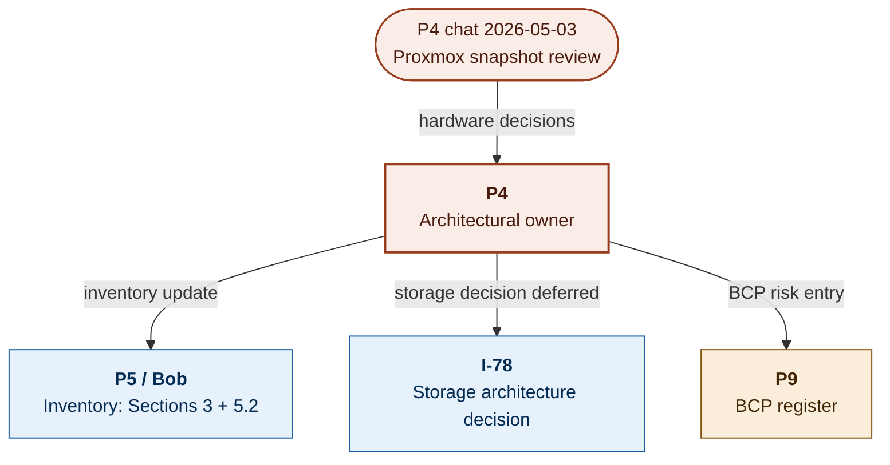

# ADR-002: nuc-cluster Hardware Selection

| Field | Value |
|---|---|
| **Status** | **APPROVED** |
| **Decision date** | 2026-05-03 |
| **Approved by** | Gregory Bernardo (President, BCG Corp) |
| **Originating session** | P4 chat 2026-05-03 (Proxmox snapshot review + parity ordering) |
| **Architectural owner** | P4 — AI Infrastructure and Deployment |
| **Cluster operator** | Jason Harris (P4 owner) |
| **Infrastructure authority** | Bob Brezniak (P5) |
| **ADR number** | ADR-002 |
| **Supersedes** | None |
| **Related** | ADR-001 (sequence convention), GOV-014 (`BCG_Infrastructure_Inventory.md` Section 3 + 5.2), I-78 (K8s Cluster Storage Architecture — Planned), I-65 (On-Prem AI Suite — consuming workload candidate) |
| **Review cadence** | Hardware refresh evaluation at 36-month mark (next: 2029-Q2). Component-level ADR amendment on any boot-tier or NIC change. |
| **Reversibility** | Partial. Boot-tier and RAM are swap-replaceable. NIC selection bound by chassis x16 slot occupancy until a chassis refresh. |

---

## 1. Context

`nuc-cluster` is a 4-node Proxmox 9.1.1 cluster (`nuc01`–`nuc04`) operating as Kubernetes worker fleet under Jason Harris's ownership, supporting Tier 3 internal workloads. Two nodes (`nuc01`, `nuc03`) reached 64 GB ECC RAM and 2 TB boot NVMe configuration in an earlier purchase cycle. Two nodes (`nuc02`, `nuc04`) shipped at 32 GB RAM and remained un-upgraded. As of the 2026-05-03 Proxmox snapshot review, all four nodes are operational but `nuc02` and `nuc04` show 80%+ memory utilization at 32 GB, demonstrably constraining the K8s scheduler's ability to balance pods across nodes uniformly.

A single-session decision was required across four hardware dimensions to bring `nuc02` and `nuc04` to parity with `nuc01`/`nuc03` and to establish the cluster-wide hardware standard going forward:

1. **Memory parity** — replace 32 GB modules with 64 GB ECC kits matching the in-place spec.
2. **Boot/primary NVMe parity** — match the WD_BLACK SN7100 2 TB drives in `nuc01`/`nuc03`.
3. **Expansion storage approach** — install 4x 1 TB NVMe drives (existing shelf inventory) without thermally coupling them to the boot drive under the compute-element shield.
4. **10 GbE NIC standardization** — codify the Intel X710-T2L choice that Jason had already deployed during cluster build-out.

This ADR formalizes those four choices so future component replacements, expansions, or sibling-cluster builds operate against a documented standard.

---

## 2. Decision — The Adopted Hardware Standard

The following per-node specification is the cluster hardware standard. All four nodes target this configuration; component replacements must match unless a successor ADR supersedes.

| Component | Selection | Quantity (per node) |
|---|---|---|
| **Chassis** | Intel NUC9VXQNX (Quartz Canyon) | 1 |
| **CPU** | Intel Xeon E-2286M (8C/16T, 2.40 GHz, 45W TDP, ECC support) | 1 (integrated) |
| **RAM** | A-Tech 64 GB ECC DDR4-2666 SODIMM kit (PC4-21300, 2Rx8, 1.2V, 260-pin) — 2x 32 GB modules | 1 kit |
| **Boot / primary NVMe** | WD_BLACK SN7100 2 TB (`WDS200T4X0E`) — M.2 2280, PCIe Gen4, DRAM-less HMB, BiCS8 218-layer TLC, 1,200 TBW, 5-yr warranty | 1 |
| **Expansion NVMe** | 1 TB NVMe (legacy shelf inventory) installed via Bejavr M.2-to-PCIe x4 passive adapter with aluminum heatsink, occupying the baseboard PCIe x4 slot | 1 |
| **Network — onboard** | 2x 1 GbE (Intel i219/i210 family on baseboard) | 2 (integrated) |
| **Network — add-in** | Intel X710-T2L dual 10GBASE-T NIC (X710-AT2 controller, PCIe 3.0 x8) — occupies baseboard PCIe x16 slot | 1 |
| **Boot mode** | EFI (Secure Boot to be normalized across all four nodes — `nuc02` confirmed; others pending verification) | — |

### 2.1 Component decisions and rationale

#### CPU and chassis

**Decision:** Standardize on the existing NUC9VXQNX / Xeon E-2286M platform.

**Rationale:** Two nodes were already deployed; adding two more sibling units preserves homogeneity for K8s scheduling, capacity planning, firmware management, and predictable failure modes. The Xeon E-2286M's 8C/16T at 45W TDP is well-matched to the K8s worker-node profile (container scheduling, ephemeral pod storage, modest sustained CPU). ECC support across all four nodes is a non-negotiable for a Tier 3 workload-bearing cluster. The platform is PCIe 3.0 throughout, which constrains drive selection (see boot tier rationale) but is acceptable given the workload class. No GPU compute is hosted on these nodes — GPU workloads remain on Spark-01/02 and gpu01/gpu02 per the AI Platform Target Architecture.

#### Memory

**Decision:** A-Tech 2x 32 GB ECC DDR4-2666 SODIMM kits.

**Rationale:** Direct match to the existing spec on `nuc01`/`nuc03`. ECC is required for the workload class. DDR4-2666 is the Xeon E-2286M's supported speed. SODIMM form factor is dictated by the NUC9 chassis. A-Tech as vendor was selected on lifetime warranty + Amazon Prime two-day availability + matching 2Rx8 dual-rank configuration. Two kits ordered 2026-05-03 to upgrade `nuc02` and `nuc04`.

**Observed pre-upgrade state (Proxmox 2026-05-03 snapshot):**

| Node | Installed RAM | Utilization at snapshot | Action |
|---|---|---|---|
| `nuc01` | 64 GB ECC | 80.84% (50.50 / 62.47 GiB) | Already at parity |
| `nuc02` | 32 GB | 83.21% (25.81 / 31.02 GiB) | Upgrade to 64 GB |
| `nuc03` | 64 GB ECC | 81.18% (50.72 / 62.47 GiB) | Already at parity |
| `nuc04` | 32 GB | 39.97% (12.40 / 31.02 GiB) | Upgrade to 64 GB |

#### Boot / primary NVMe

**Decision:** WD_BLACK SN7100 2 TB (`WDS200T4X0E`).

**Rationale:** Direct match to drives Jason deployed in `nuc01`/`nuc03`. The SN7100's design characteristics independently make it the right choice for the NUC9 thermal envelope: DRAM-less HMB, single-sided 2280 form factor, BiCS8 218-layer TLC, and a Polaris 3 controller positioned as the "power efficiency king" in current-generation reviews. The platform-wide PCIe 3.0 ceiling (~3,500 MB/s sequential) caps any Gen4-spec drive at the same throughput, so paying a premium for raw Gen4 performance returns nothing in this chassis. Fleet consistency is the dominant criterion: identical firmware behavior, identical SMART attributes, identical wear-leveling, identical thermal profile across all four nodes simplifies capacity planning and any future distributed-storage replication work.

#### Expansion NVMe approach

**Decision:** 1 TB NVMe drives (existing shelf inventory) installed via Bejavr M.2-to-PCIe x4 passive adapter in the baseboard x4 PCIe slot, NOT in the secondary onboard M.2 slot.

**Rationale:** The NUC9 compute element houses the CPU plus the boot M.2 drive under a shared thermal shield. Stacking a second NVMe under that shield thermally couples the two drives, raising sustained operating temperature for both. Mounting the expansion drive in the baseboard PCIe slot puts it in the airflow path of the chassis fans, with its own aluminum heatsink and thermal pads from the adapter. Performance is unaffected — the adapter is a passive passthrough and the platform's PCIe 3.0 ceiling applies regardless of slot. The Bejavr adapter is an unbranded passive carrier with an aluminum heatsink and dual thermal pads; selection criteria were physical fit (low-profile bracket compatible with NUC9), trace integrity (passive design — no controller chip, no failure mode beyond the drive itself), and price. No proprietary drivers or firmware involved.

#### 10 GbE NIC

**Decision:** Intel X710-T2L dual 10GBASE-T (X710-AT2 controller).

**Rationale:** Codifies the choice Jason already made during cluster build-out. The Intel `i40e` Linux driver is in-kernel mainline since version 3.19 and operates without configuration on Proxmox 9.1.1 / kernel 6.17.2. PCIe 3.0 x8 fits the NUC9 baseboard x16 slot with electrical headroom. The 10GBASE-T copper interface integrates with BCG's existing Cat6/6a copper plant without transceivers. The card's PHY power profile (~14–18 W per dual-port card under load) is hotter than an SFP+ equivalent, but the NUC9 chassis dual 80mm top fans handle the dissipation in observed operation; mitigation if needed is fan curve tuning, not a NIC swap. The 10 GbE fabric across the cluster is the prerequisite that makes distributed K8s persistent storage (I-78) operationally feasible.

---

## 3. Alternatives Rejected

| Component | Rejected alternative | Rejection rationale |
|---|---|---|
| Boot NVMe | **Crucial T500 2 TB** | Strong drive on independent merit (Phason E25 + Micron 232L TLC, excellent thermal profile, lower price). Rejected solely to preserve fleet consistency with the SN7100s already deployed in `nuc01`/`nuc03`. |
| Boot NVMe | **WD_BLACK SN850X 2 TB** | Higher per-drive price, runs significantly hotter under sustained I/O, DRAM cache provides no benefit at the platform's PCIe 3.0 ceiling. Premium cost with no return in this chassis. |
| Boot NVMe | **Samsung 990 EVO Plus 2 TB** | Architecturally equivalent class to the SN7100 (DRAM-less HMB, current-gen TLC). Acceptable as a substitute if the SN7100 became unavailable, but no advantage over the in-place standard. Logged as the preferred fallback if the SN7100 is ever supply-constrained. |
| Expansion NVMe slot | **Onboard secondary M.2 slot** | Stacks the expansion drive under the compute-element thermal shield with the boot drive, raising sustained temperatures for both. The PCIe x4 slot path provides thermal isolation, separate airflow, and equivalent throughput. |
| 10 GbE NIC | **Intel X710-DA2 (SFP+)** | Lower power draw than the 10GBASE-T variant. Rejected because adopting SFP+ requires either DAC cabling (limits run length and reuse) or transceivers (added per-port cost). BCG's existing copper plant is the determining factor. |
| 10 GbE NIC | **Onboard 1 GbE only (no add-in NIC)** | Caps cluster east-west traffic and any distributed-storage replication at ~110 MB/s. Forecloses I-78 (distributed PV strategy). Not viable. |
| Memory | **Non-ECC DDR4-2666 SODIMM** | Cheaper but unsupported for Tier 3 workload-bearing cluster. ECC is the floor, not an upgrade. |

---

## 4. Cross-Project Impact and Consequences

| Project | Impact | Action / consequence |
|---|---|---|
| **P0** | Synthesis hub awareness only | No direct action. Documented infrastructure asset relevant to build-to-sell narrative — inspectable, transferable, transferable on documented hardware standard. |
| **P4** | Architectural owner | Owns this ADR and the I-78 storage architecture decision that depends on the cluster's 10 GbE + expansion-NVMe foundation. |
| **P5** | Infrastructure inventory authority | Updates `BCG_Infrastructure_Inventory.md` Section 3 (operational view) and Section 5.2 (procurement record) to reflect 4-node deployment. Repository status (`pve-no-subscription`) acceptable while cluster carries Tier 3 only; revisit on Tier 2+ workload introduction. |
| **P5-002** | Monitoring | Add cluster nodes to Prometheus scrape targets when `node_exporter` is deployed. Not blocking. |
| **P9** | BCP risk register | Cluster is now meaningful infrastructure (256 GB RAM, 12 TB NVMe, 10 GbE fabric). Add to dependency risk register with documented fallback for any Jason-owned services that depend on it. |
| **Subprojects** | None directly | I-78 (open initiative) carries the storage architecture decision. |

### 4.1 Routing topology

---

## 5. Business Continuity Assessment (P9 Routing)

This section is the substance of `[FLAG FOR P9 — BCP RISK ENTRY]`. P9 should integrate the contents below into the BCG Enterprise BCP dependency risk register on adoption.

### 5.1 Risks identified

| Risk | Failure mode | Blast radius |
|---|---|---|
| Single-node hardware failure | One of four NUC9VXQNX nodes loses power, drive, or NIC | **LOW.** K8s scheduler reschedules pods to remaining three nodes. Storage replication factor (per I-78 decision) determines whether persistent state is preserved. Cluster operates at 75% capacity until replacement. |
| Boot-tier NVMe wear-out | SN7100 reaches end of TBW endurance | **LOW.** 1,200 TBW per drive; expected service life >7 years at projected K8s worker write loads. SMART monitoring via `node_exporter` once deployed. Replacement is single-drive, single-node operation. |
| NUC9 platform end-of-life | Intel ceases NUC9 support; replacement chassis unavailable | **MEDIUM (long-horizon).** Platform is already older-generation; replacement units are second-hand market. ADR amendment trigger: when a node fails and a replacement NUC9VXQNX cannot be sourced, evaluate successor chassis (likely a small-form-factor Xeon E-class platform). 36-month review cadence. |
| 10 GbE switch fabric outage | Switch failure cuts cluster east-west traffic | **MEDIUM.** All distributed storage and inter-node K8s services degrade. Onboard 1 GbE remains as fallback path but at ~10% throughput. P5/Bob owns switch redundancy planning. |
| Vendor abandonment of A-Tech ECC kits | Memory replacement supply disruption | **LOW.** ECC DDR4-2666 SODIMM is a standard SKU class; multiple vendors (Crucial, Kingston, Samsung) produce drop-in equivalents. Selection criteria documented in this ADR's Section 2.1; substitute is straightforward. |

### 5.2 Single points of failure

- **Switch fabric** (10 GbE) is the single point of cluster network failure. Owned by P5/Bob outside the scope of this ADR.
- **Power** to the NUC9 fleet — covered by the Section 17 UPS inventory in `BCG_Infrastructure_Inventory.md`. No new exposure introduced by this ADR.
- **The NUC9 platform itself** is approaching long-horizon end-of-life. Acceptable for current cluster lifespan; flagged for 36-month review.

### 5.3 Mitigations

- **PRIMARY:** 4-node cluster provides N+1 redundancy at the node level. Loss of any one node degrades capacity but does not halt operations (subject to I-78 storage decisions for persistent state).
- **SECONDARY:** Memory and boot-NVMe spec is commodity-class — replacement parts available from multiple vendors at 1–2 day lead times.
- **TERTIARY:** No Tier 1–2 client data is permitted on this cluster. Worst-case full cluster failure does not breach the security boundary.
- **OPERATIONAL:** Repository status (`pve-no-subscription`) acceptable for current Tier 3 use; revisit if cluster takes Tier 2+ workloads.

### 5.4 Acceptable failure modes

All identified failure modes are acceptable. No combination of node failures blocks a billable client deliverable, halts a regulatory commitment, or compromises the on-premises security boundary. Worst realistic case is degraded cluster capacity for 1–3 days while a replacement node is procured and provisioned.

### 5.5 Review cadence

- **Hardware refresh evaluation** at 36-month mark (next: 2029-Q2). Triggered earlier on any node failure where NUC9VXQNX replacement units cannot be sourced.
- **Component-level ADR amendment** on any boot-tier or NIC change.
- **Cluster-level review** on any Tier 2+ workload proposal targeting `nuc-cluster`.

---

## 6. Implementation Actions

| # | Action | Owner | Status |
|---|---|---|---|
| 1 | Approve this ADR | Gregory | ✅ **COMPLETE** (2026-05-03) |
| 2 | Order 2x A-Tech 64 GB ECC DDR4-2666 SODIMM kits for `nuc02`/`nuc04` upgrade | Gregory | ✅ **COMPLETE** (2026-05-03 — Amazon order, deliver 2026-05-05) |
| 3 | Order 2x WD_BLACK SN7100 2 TB drives for `nuc02`/`nuc04` boot-tier parity | Gregory | ⬜ Open |
| 4 | Install RAM upgrade on `nuc02` and `nuc04` | Bob | ⬜ Open (post-delivery) |
| 5 | Install boot-tier SN7100 drives on `nuc02` and `nuc04` (verify slot topology matches `nuc01`/`nuc03` CPU-direct slot) | Bob + Jason | ⬜ Open |
| 6 | Install 4x 1 TB expansion NVMe via Bejavr adapters (one per node) — **DO NOT FORMAT until I-78 storage architecture decision is made** | Bob + Jason | ⬜ Open |
| 7 | Verify Secure Boot status across all four nodes; normalize to a consistent EFI configuration | Bob | ⬜ Open |
| 8 | Update `BCG_Infrastructure_Inventory.md` Section 3 + Section 5.2 to reflect 4-node deployment and full per-node spec | P4 | ✅ **COMPLETE** (companion commit, v1.6) |
| 9 | Register I-78 (K8s Cluster Storage Architecture) in `BCG_Initiative_and_Workstream_Catalog.md` | P4 | ✅ **COMPLETE** (companion commit, v3.4) |
| 10 | Update `BCG_Governance_Doc_Registry.md` with ADR-002 entry | P4 / Greg | ⬜ Open (follow-up commit) |
| 11 | Add cluster to BCG Enterprise BCP dependency risk register (use §5 as source) | P9 / Bob | ⬜ Open |
| 12 | Add cluster nodes to Prometheus scrape targets when `node_exporter` is deployed | P5-002 / Bob | ⬜ Open (non-blocking) |

---

## 7. Routing and Handoffs

`[FROM: P4 — AI Infrastructure & Deployment] [DATE: 2026-05-03] [TOPIC: ADR-002 nuc-cluster Hardware Selection — APPROVED]`

**`[FLAG FOR P5 — INVENTORY UPDATE]`** Bob to merge inventory updates per companion commit (`BCG_Infrastructure_Inventory.md` v1.6). Open verifications: Section 5.2 procurement record for NUC9 unit purchase dates beyond the original Jan 2025 order; Secure Boot normalization across all four nodes.

**`[FLAG FOR P9 — BCP RISK ENTRY]`** Add `nuc-cluster` to BCG Enterprise BCP dependency risk register using §5 as source content. Schedule 36-month hardware refresh review co-owned with P4.

**`[FLAG FOR P5-002 — MONITORING]`** Add four cluster nodes to Prometheus scrape targets on `node_exporter` deployment. Non-blocking.

**`[INFO TO P0 — SYNTHESIS HUB]`** Documented infrastructure asset relevant to build-to-sell narrative.

**`[DEPENDENCY: I-78 needs Jason's storage architecture decision before any of the four expansion NVMes are formatted ad-hoc.]`** I-78 is registered in `BCG_Initiative_and_Workstream_Catalog.md` v3.4 (companion commit) with Action 6 above as the explicit no-format gate.

---

## 8. Approval Record

| Date | Event | Recorded by |
|---|---|---|
| 2026-05-03 | Originating session: P4 chat — Proxmox snapshot review identified `nuc02`/`nuc04` memory parity gap; multi-component decisions consolidated | P4 chat history |
| 2026-05-03 | A-Tech 64 GB ECC kits ordered (last-purchased timestamp on Amazon listing) | Procurement record |
| 2026-05-03 | Status PROPOSED → APPROVED. Number assigned: ADR-002. | Gregory Bernardo, P4 chat |
| 2026-05-03 | This canonical Markdown committed to `standards/`. Companion Inventory v1.6 and Catalog v3.4 commits land in same commit set. | P4 / Greg via GitHub MCP API |

---

*Source: P4 chat 2026-05-03. Canonical Markdown form. Companion `.docx` archive optional — not required for ADR-002 since the decision is hardware-selection rather than a published reference standard.*
